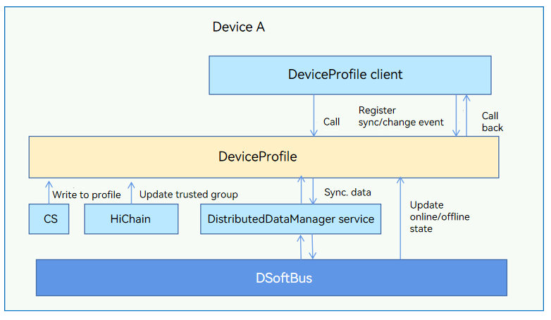

# Distributed DeviceProfile

## Introduction

DeviceProfile is used to manage device hardware capabilities and system software features. A typical device profile includes the device type, device name, OS type, and OS version. By allowing quick access to local and remote device profiles, DeviceProfile lays the foundation for initiating distributed services. 

DeviceProfile provides the following functions:

-   Inserting, deleting, and querying profiles of local devices.
-   Querying remote device profile information.
-   Subscribing to remote device profile changes.
-   Synchronizing profile information across devices.

The following figure shows the architecture of the DeviceProfile module.

## Architecture

**Figure 1** DeviceProfile component architecture





## Directory Structure

The main code directory structure of DeviceProfile is as follows:

```
├── interfaces
│   └── innerkits
│       └── distributeddeviceprofile            // innerkits APIs
├── ohos.build
├── sa_profile                                  // SAID profile
│   ├── 6001.xml
│   └── BUILD.gn
└── services
    └── distributeddeviceprofile
        ├── BUILD.gn
        ├── include
        │   ├── authority                       // Permission verification
        │   ├── contentsensor                   // Header file for content sensor data collection
        │   ├── dbstorage                       // Header file for database operations
        │   ├── devicemanager                   // Header file for device management
        │   └── subscribemanager                // Header file for subscription management
        ├── src
        │   ├── authority                       // Permission verification
        │   ├── contentsensor                   // Implementation of content sensor data collection
        │   ├── dbstorage                       // Implementation of database operations
        │   ├── devicemanager                   // Implementation of device management
        │   └── subscribemanager                // Implementation of subscription management
        └── test                                // Test cases
```

## Constraints

-   The devices between which you want to set up a connection must be in the same LAN.
-   Before setting up a connection between two devices, you must bind the devices. For details about the binding process, see the Security subsystem readme file.

## Usage

### Querying Profile Information

* Parameters of **GetDeviceProfile**

| Name     | Type                         | Mandatory| Description                               |
| --------- | ---------------------------- | ---- | ----------------------------------- |
| deviceId  | std::string                  | Yes  | ID of the device whose profile is to be queried. A null value indicates the local device.|
| serviceId | std::string                  | Yes  | Service ID.                    |
| profile   | ServiceCharacteristicProfile | Yes  | Device profile information returned.                              |

* Sample code

```c++
// Declare the return value.
ServiceCharacteristicProfile profile;
// Call GetDeviceProfile.
DistributedDeviceProfileClient::GetInstance().GetDeviceProfile(deviceId, serviceId, profile);
std::string jsonData = profile.GetCharacteristicProfileJson();
result.append("jsonData:" + jsonData + "\n");
```

### Inserting Profile Information

* Parameters of **PutDeviceProfile**

| Name     | Type                         | Mandatory| Description                               |
| --------- | ---------------------------- | ---- | ----------------------------------- |
| profile   | ServiceCharacteristicProfile | Yes  | Profile information to insert.               |

* Sample code

```c++
// Declare and fill in the data to insert.
ServiceCharacteristicProfile profile;
profile.SetServiceId(serviceId);
profile.SetServiceType(serviceType);
nlohmann::json j;
j["testVersion"] = "3.0.0";
j["testApiLevel"] = API_LEVEL;
profile.SetCharacteristicProfileJson(j.dump());
// Call PutDeviceProfile.
DistributedDeviceProfileClient::GetInstance().PutDeviceProfile(profile);
```

### Deleting Profile Information

* Parameters of **DeleteDeviceProfile**

| Name     | Type                         | Mandatory| Description                               |
| --------- | ---------------------------- | ---- | ----------------------------------- |
| serviceId | std::string                  | Yes  | ID of the service record to delete.             |

* Sample code

```c++
// Declare and fill in the data to delete.
std::string serviceId = "test";
// DeleteDeviceProfile
DistributedDeviceProfileClient::GetInstance().DeleteDeviceProfile(serviceId);
```

### Synchronizing Profile Information

* Parameters of **SyncDeviceProfile**

| Name     | Type                         | Mandatory| Description                               |
| --------- | ---------------------------- | ---- | ----------------------------------- |
| syncOption| SyncOption                   | Yes  | Synchronization range and mode.                   |
| syncCb    | IProfileEventCallback        | Yes  | Callback used to return the synchronization result.                        |

* Sample code

```c++
// Define the synchronization mode and range.
SyncOptions syncOption;
syncOption.SetSyncMode((OHOS::DeviceProfile::SyncMode)atoi(mode.c_str()));
for (const auto& deviceId : deviceIds) {
    syncOption.AddDevice(deviceId);
}
// Call SyncDeviceProfile.
DistributedDeviceProfileClient::GetInstance().SyncDeviceProfile(syncOption,
    std::make_shared<ProfileEventCallback>());
```

### Subscribing to Profile Events (Synchronization and Change Events)

* Parameters of **SubscribeProfileEvents**

| Name          | Type                         | Mandatory| Description                               |
| -------------- | ---------------------------- | ---- | ----------------------------------- |
| subscribeInfos | SubscribeInfo                | Yes  | Type of the event to subscribe to.                   |
| eventCb        | IProfileEventCallback        | Yes  | Callback used to return the subscription event.                        |
| failedEvents   | ProfileEvent                 | Yes  | Failure event.                            |

* Sample code

```c++
auto callback = std::make_shared<ProfileEventCallback>();
std::list<SubscribeInfo> subscribeInfos;

// Subscribe to the EVENT_PROFILE_CHANGED event.
ExtraInfo extraInfo;
extraInfo["deviceId"] = deviceId;
extraInfo["serviceIds"] = serviceIds;
SubscribeInfo changeEventInfo;
changeEventInfo.profileEvent = ProfileEvent::EVENT_PROFILE_CHANGED;
changeEventInfo.extraInfo = std::move(extraInfo);
subscribeInfos.emplace_back(changeEventInfo);

// Subscribe to the EVENT_SYNC_COMPLETED event.
SubscribeInfo syncEventInfo;
syncEventInfo.profileEvent = ProfileEvent::EVENT_SYNC_COMPLETED;
subscribeInfos.emplace_back(syncEventInfo);

// Call SubscribeProfileEvents.
std::list<ProfileEvent> failedEvents;
DistributedDeviceProfileClient::GetInstance().SubscribeProfileEvents(subscribeInfos,
    callback, failedEvents);

// Cancel the subscription.
std::list<ProfileEvent> profileEvents;
profileEvents.emplace_back(ProfileEvent::EVENT_PROFILE_CHANGED);
DistributedDeviceProfileClient::GetInstance().UnsubscribeProfileEvents(profileEvents,
    callback, failedEvents);
```

### Common error codes returned by the interface

|              Definition             |  Return Value  |                     Meaning                 |
| ----------------------------------- | -------------- | ------------------------------------------- |
| DP_SUCCESS                          | 0              |   DP success                                |
| DP_INVALID_PARAMS                   | 98566144       |   DP invalid parameters                     |
| DP_GET_LOCAL_UDID_FAILED            | 98566146       |   DP failed to get local UDID               |
| DP_GET_SERVICE_FAILED               | 98566147       |   DP failed to get service                  |
| DP_INIT_DB_FAILED                   | 98566148       |   DP failed to initialize database          |
| DP_NOT_INIT_DB                      | 98566157       |   DP database not initialized               |
| DP_CACHE_EXIST                      | 98566164       |   DP cache exists                           |
| DP_PUT_KV_DB_FAIL                   | 98566197       |   DP failed to write KV database            |
| DP_DEL_KV_DB_FAIL                   | 98566198       |   DP failed to delete KV database           |
| DP_GET_KV_DB_FAIL                   | 98566199       |   DP failed to query KV database            |
| DP_KV_SYNC_FAIL                     | 98566204       |   DP KV synchronization failed              |
| DP_NOT_FIND_DATA                    | 98566221       |   DP data not found                         |
| DP_READ_PARCEL_FAIL                 | 98566236       |   DP failed to read IPC                     |
| DP_WRITE_PARCEL_FAIL                | 98566235       |   DP failed to write IPC                    |
| DP_PERMISSION_DENIED                | 98566155       |   DP permission denied                      |
| DP_PUT_TRUST_DEVICE_PROFILE_FAIL    | 98566218       |   DP failed to write trusted device profile |
| DP_PUT_ACL_PROFILE_FAIL             | 98566170       |   DP failed to write ACL profile            |
| DP_GET_ALL_TRUST_DEVICE_PROFILE_FAIL| 98566169       |   DP failed to get all trusted devices      |
| DP_UPDATE_ACL_PROFILE_FAIL          | 98566171       |   DP failed to update ACL profile           |

## Repositories Involved

[**deviceprofile_device_info_manager**](https://gitee.com/openharmony/deviceprofile_device_info_manager)
